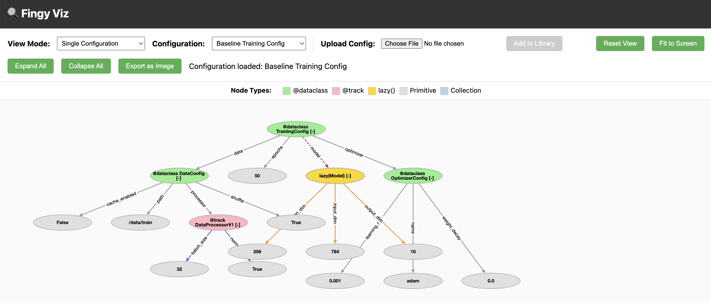
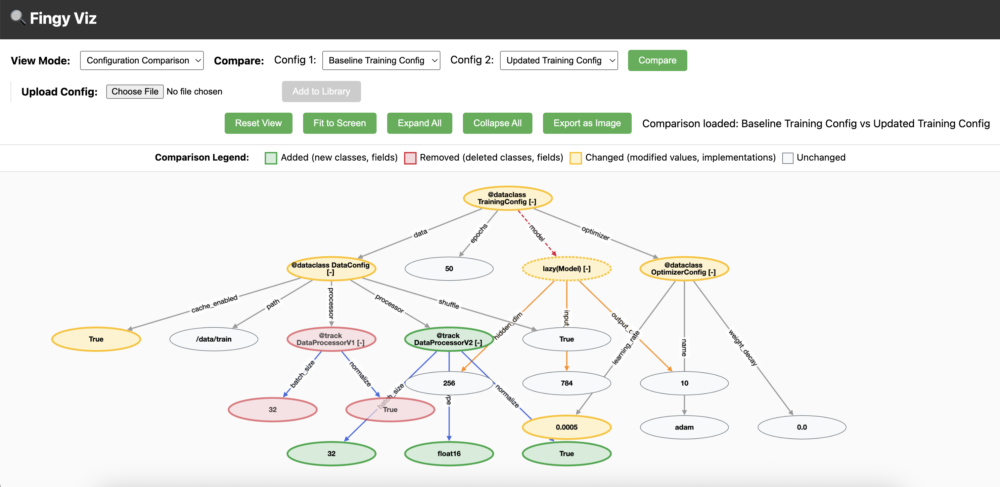

# Diving Deeper

## Serialization and Deserialization

A `fingy` is any object that can be serialized or deserialized by `confingy`. Currently, this list includes:

1. Python built-in scalars like integers, floats, and strings.
2. Basic collections like lists, tuples, sets, and dictionaries.
3. Python or Pydantic dataclasses.
4. Any class wrapped with [confingy.track][confingy.tracking.track] or [confingy.lazy][confingy.tracking.lazy].
5. Callables, like functions.
6. Python types.

For item 4 above, all of the arguments to the class must also be serializable. Via this method, we form a serializable chain or graph such that everything can be deserialized.

!!! note
    We only serialize the constructor arguments such that we can re-instantiate a class during deserialization. We do not serialize the _state_ of any class. That must be handled separately. As a concrete example, if you're using PyTorch, you can use `confingy` re-instantiate your `nn.Module`, but you will need to call `load_state_dict()` in order to load saved tensor values.

Serializing a `fingy` to JSON has a number of benefits:

1. You can keep track of the exact configuration for a training run or job in a simple format.
1. If you save the JSON with your PyTorch checkpoint, you can entirely reconstruct your model from these two files.
1. You can track your configuration in tools like [Weights and Biases](https://wandb.ai) by passing in the JSON as the `wandb` config. You can also pass the JSON through [confingy.prettify_serialized_fingy][confingy.prettify_serialized_fingy] to make it easier to read in `wandb`.
1. As long as your remote machine has a copy of your python code, you can ship your job to run there via the JSON fingy.
1. You can diff your JSON `fingys` in order to see what changed between training runs. The serialized `fingy` also contains a hash of any code that was tracked. This provides a (weak) way to detect regressions due to code changes.

## Features

`confingy` is packed with many features that are a byproduct of building a python-native configuration system.

### Transpiler

Imagine you serialize a `fingy` to JSON (i.e. you serialize some object that is capable of being tracked by `confingy`, such as a tracked class or dataclass). While you can now deserialize that JSON back into Python, you won't know the exact Python _code_ that was used to originally create the `fingy`. 

As a concrete example, you may create a `fingy` that configures a machine learning training job, and you'd like to reconstruct that Python. With [confingy.transpile_fingy][confingy.fingy.transpile_fingy], you can do just that.

```python
from dataclasses import dataclass
from confingy import track, serialize_fingy, transpile_fingy, Lazy

@track
class Foo:
    def __init__(self, bar: str):
        self.bar = bar

@track
class Baz:
    def __init__(self, foo: Foo):
        self.foo = foo

@dataclass
class MyConfig:
    baz: Lazy[Baz]

config = MyConfig(
    baz=Baz.lazy(foo=Foo("my_bar"))
)
serialized = serialize_fingy(config)
python_code = transpile_fingy(serialized)
print(python_code)
```

Output:

```python
from confingy import lazy
from __main__ import Baz, Foo, MyConfig

config = MyConfig(baz=lazy(Baz)(foo=Foo(bar='my_bar')))
```

You can also transpile a JSON-serialized `fingy` via the [CLI][confingy.cli.main]:

```commandline
confingy transpile my_config.json --output my_config.py
```

### Visualization

`confingy` ships with an optional browser-based server for visualizing your serialized configuration. You can install it with 

```commandline
pip install confingy[viz]
```

and then run the server from the command line:

```commandline
confingy viz
```

This will start the server at http://localhost:8000.

The server has 2 primary features:

1. Visualize the graph of your `fingy`.
    
2. Compare two `fingys` to see what changed.
    


### Modifying Configurations

`confingy` provides several ways to create modified versions of your configurations.

#### `.copy()` for Lazy Objects

The [.copy()][confingy.tracking.Lazy.copy] method creates a new `Lazy` instance with updated parameters. The original remains unchanged (immutable pattern):

```python
from confingy import track

@track
class Model:
    def __init__(self, layers: int, dropout: float):
        self.layers = layers
        self.dropout = dropout

base = Model.lazy(layers=4, dropout=0.1)
large = base.copy(layers=8)

print(base.get_config())   # {'layers': 4, 'dropout': 0.1}
print(large.get_config())  # {'layers': 8, 'dropout': 0.1}
```

#### Nested Updates

When your configuration is composed entirely of `Lazy` objects, you can modify nested values directly via attribute access:

```python
from confingy import track, Lazy

@track
class Optimizer:
    def __init__(self, lr: float):
        self.lr = lr

@track
class Trainer:
    def __init__(self, optimizer: Lazy[Optimizer]):
        self.optimizer = optimizer

lazy_trainer = Trainer.lazy(optimizer=Optimizer.lazy(lr=0.001))
lazy_trainer.optimizer.lr = 0.01  # Direct nested modification
print(lazy_trainer.optimizer.lr)  # 0.01
```

However, if your configuration contains instantiated tracked objects (not just `Lazy`), you'll need [lens()][confingy.tracking.lens] and [unlens()][confingy.tracking.Lazy.unlens]. `lens()` converts the entire structure into a modifiable `Lazy`, and `unlens()` reconstructs the original structure with your changes:

```python
from confingy import lens

# Mixed structure: instantiated Trainer containing a Lazy Optimizer
trainer = Trainer(optimizer=Optimizer.lazy(lr=0.001))

# Create a lens to enable nested modifications
trainer_lens = lens(trainer)
trainer_lens.optimizer.lr = 0.01

# Reconstruct with modifications
modified_trainer = trainer_lens.unlens()
print(modified_trainer.optimizer.lr)  # 0.01
```

!!! warning
    `unlens()` will **reinstantiate** any tracked objects with the updated arguments. This means the returned object is a new instance, not the original with mutated state.

For more examples, see [Lensing and Unlensing](examples/lens.md).

## Migrating to Confingy

One of `confingy`'s central tenets is that it should be easy to migrate to without too many changes to your non-configuration code. For example, it could be painful to add [@confingy.track()][confingy.tracking.track] decorators to all of your classes, so you can instead use its functional form only when configuring your system:

```python
from confingy import track

class Foo:
    def __init__(self, bar: str):
        self.bar = bar

my_foo = track(Foo)("my_bar")
```

If you have a concept of "dynamically instantiating classes based on configuration" in your existing system, then you can replace that code with calling [.instantiate()][confingy.tracking.Lazy.instantiate] on any [Lazy][confingy.tracking.Lazy] class.

If you're migrating from a YAML-based system like OmegaConf, then we recommend using an AI system to help your write two dirty scripts, based on your system spec:

1. A script to generate the `confingy`-compatible Python code from your YAML configuration. If it's easier, you can take advantage of the [transpiler](#transpiler) to first generate a JSON-serialized `fingy` and then transpile that to Python code.
1. A script to compare your YAML configuration to `confingy`'s JSON-serialized `fingy` representation. This can help to detect issues in the middle of Step 1.

## Configuration Architectures

Machine Learning engineering carries an inherent tension: you want maximum flexibility, in order to run experiments, while also requiring robust reproducibility. This tensions finds its way into our configuration systems, since the ability to configure a job is foundational to flexibility.

The way that this manifests in typical ML projects is that we often start with the maximally flexible design: a script with hardcoded parameters. We update manually update these parameters as we launch experiments. Eventually, we have to refactor this because either the experiment gets more complicated or we start collaborating with other people. 

Along these lines, we recommend architecting your project with `confingy` in a similar, progressively pragmatic manner.

To start, you could simply use `confingy` directly and update your configuration _in situ_. The benefit of using `confingy` in this approach is that you get tracking and serialization of your configuration, for free. Below, we show a simple example of configuring a linear model and toy dataset.

```python
from dataclasses import dataclass 

import torch
from confingy import track, Lazy


@track
class LinearModel(torch.nn.Module):
    def __init__(self, num_features: int):
        super().__init__()
        self.linear = torch.nn.Linear(num_features, 1)

    def forward(self, x):
        return self.linear(x)


@track
class ToyDataset(torch.utils.data.Dataset):
    def __init__(self, num_samples: int, num_features: int):
        self.x = torch.randn(num_samples, num_features)
        self.y = torch.randn(num_samples, 1)

    def __len__(self):
        return self.x.shape[0]

    def __getitem__(self, idx):
        return self.x[idx], self.y[idx]


@dataclass
class Config:
    model: Lazy[torch.nn.Module]
    dataset: torch.utils.data.Dataset


my_config = Config(
    model=LinearModel.lazy(num_features=8),
    dataset=ToyDataset(num_samples=1_000, num_features=8)
)
```

Note that `num_features` and `num_samples` are hardcoded above. In many ways, that's okay. We could update them in line, and `confingy` will track them just fine, and we can also keep a record of them by calling `confingy.save_fingy(my_config, "my_config.json")`.

If I wanted to change my model to, say, a neural net, all I'd need to do is the following:

```python

@track
class NeuralNet(torch.nn.Module):
    def __init__(self, num_features: int, hidden_units: int, num_layers: int):
        super().__init__()
        self.layers = torch.nn.ModuleList()
        self.layers.append(torch.nn.Linear(num_features, hidden_units))
        self.layers.append(torch.nn.ReLU())
        for _ in range(num_layers - 1):
            self.layers.append(torch.nn.Linear(hidden_units, hidden_units))
            self.layers.append(torch.nn.ReLU())
        self.layers.append(torch.nn.Linear(hidden_units, 1))

    def forward(self, x):
        for layer in self.layers:
            x = layer(x)
        return x

my_config = Config(
    model=NeuralNet.lazy(num_features=8, hidden_units=4, num_layers=2),
    dataset=ToyDataset(num_samples=1_000, num_features=8)
)
```

However, note that `num_features` gets used in both the `model` and the `dataset`. If we want to change it, we have to change it in both places. You may be tempted to move this value to a variable in order to ensure that:

```python

NUM_FEATURES = 8

my_config = Config(
    model=NeuralNet.lazy(num_features=NUM_FEATURES, hidden_units=4, num_layers=2),
    dataset=ToyDataset(num_samples=1_000, num_features=NUM_FEATURES)
)
```

And if you have multiple of these types of variables, you may want to package them up into a class. Perhaps, a class to store your configuration... And now you find yourself building a configuration system for your configuration system!

To be fair, there is probably no getting around this, but we can at least try to make it not too painful. We've found the following architecture to help:

First, define a high level configuration dataclass, like our `Config` class that only contains the `model` and the `dataset`. Our goal is now to design a process to build the `model` and `dataset`. For each of these objects, we define a `Builder` class, and that `Builder` class takes in a configuration dataclass to build the final object.

Here, let me show you:

```python
from typing import Protocol, TypeVar
from dataclasses import dataclass

T = TypeVar("T")


@dataclass
class Config:
    model: Lazy[torch.nn.Module]
    dataset: torch.utils.data.Dataset


class Builder(Protocol[T]):
    def __init__(self) -> None: ...

    def __call__(self, hyperparams: "Hyperparams") -> T: ...


@dataclass
class Hyperparams:
    num_features: int

    def to_config(
        self, 
        model_builder: Builder[Lazy[torch.nn.Module]],
        data_builder: Builder[torch.utils.data.Dataset]
    ) -> Config:
        return Config(
            model=model_builder(self),
            dataset=data_builder(self)
        )


class DataBuilder:

    def __call__(self, hyperparams: Hyperparams) -> torch.utils.data.Dataset:
        return ToyDataset(num_samples=1_000, num_features=hyperparams.num_features)


class ModelBuilder:

    def __call__(self, hyperparams: Hyperparams) -> Lazy[torch.nn.Module]:
        return LinearModel.lazy(num_features=hyperparams.num_features)


linear_model_config = Hyperparams(num_features=8).to_config(DataBuilder(), ModelBuilder())

```

This probably seems like overkill! Sure, it's nice that we have `num_features` in one place, but why all the complexity? The reason is that this pattern supports progressive configuration. To start, imagine we want to create a config for our neural net model. There are a couple ways we can do this beyond replacing the code in `ModelBuilder`. 

We can pass in a different `ModelBuilder` to `Hyperparams.to_config()`.

We can add a flag and some other parameters to the `Hyperparams`:

```python
from typing import Literal 

@dataclass
class Hyperparams:
    num_features: int
    num_layers: int
    num_hidden_units: int
    model_type: Literal["linear", "neural"]


class ModelBuilder:

    def __call__(self, hyperparams: Hyperparams) -> Lazy[torch.nn.Module]:
        if hyperparams.model_type == "linear":
            return LinearModel.lazy(num_features=hyperparams.num_features)
        elif hyperparams.model_type == "neural":
            return NeuralNet.lazy(
                num_features=hyperparams.num_features, 
                num_layers=hyperparams.num_layers,
                num_hidden_units=hyperparams.num_hidden_units
            )
        else:
            raise ValueError(f"{hyperparams.model_type=} is not a valid model_type!")

```

If `ModelBuilder` is already quite complex, and there are some intermediate objects that are being created, then we can always subclass `ModelBuilder` and refactor the creation of an intermediate object into a subclassed method. As an example, let's say we have a builder like the following:

```python
class ModelBuilder:
    def __call__(self, hyperparams: Hyperparams) -> Lazy[torch.nn.Module]:
        foo = Foo(...)
        bar = Bar(foo, ...)
        return Baz.lazy(bar, ...)
```

we can refactor it into

```python
class ModelBuilder:

    def _make_bar(self, foo, hyperparams):
        return Bar(foo, ...)

    def __call__(self, hyperparams: Hyperparams) -> Lazy[torch.nn.Module]:
        foo = Foo(...)
        bar = self._make_bar(foo, hyperparams)
        return Baz.lazy(bar, ...)
```

and then subclass this class in order to implement our own logic

```python
class SpecialBarModelBuilder(ModelBuilder):

    def _make_bar(self, foo, hyperparams):
        return Bar(foo, special_things=True, ...)
```

Taking stock, the `Builder` process resembles the path that we take from hardcoded script, to flags and other conditional `if` statements, to functions and classes.